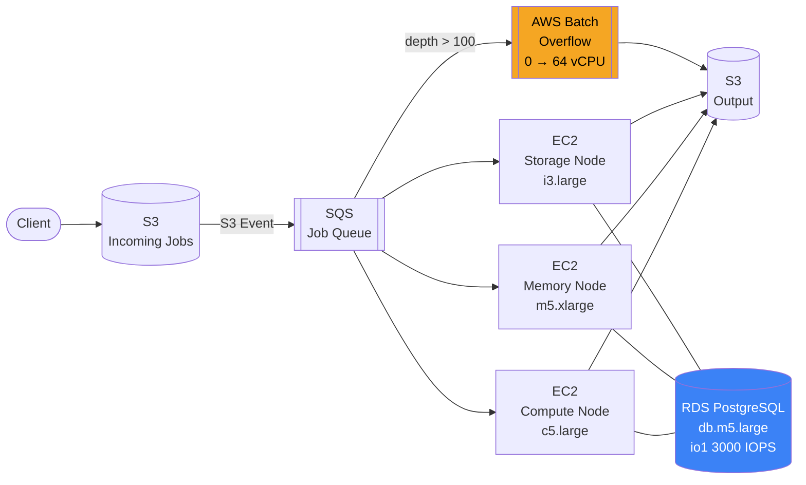
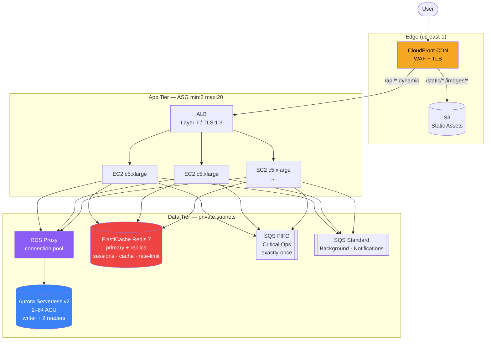

# AWS Scaling Recipes

[](https://github.com/your-org/aws-scaling-recipes/actions/workflows/ci.yml)

Production-derived AWS scaling patterns as deployable CloudFormation recipes.
Two complete, ready-to-deploy scenarios covering the two fundamental scaling strategies.

| Recipe | Pattern | Stacks | Use when |
|--------|---------|--------|----------|
| [Vertical](Vertical/) | Single-instance growth | 6 | Steady load, monolithic/legacy app, batch processing |
| [Horizontal](Horizontal/) | Elastic fleet + CDN | 7 | Unpredictable spikes, stateless app, consumer-facing |

---

## Quickstart

```bash
# 1. Edit config.env — fill in your VPC, subnets, email, and certificate values
# 2. Store DB passwords in SSM Parameter Store (commands in config.env)
# 3. Check prerequisites
./deploy.sh check

# 4. Deploy
./deploy.sh vertical      # or horizontal, or both
```

---

## Vertical Scaling Recipe

### When to use

- Workload is **batch/queue-driven**: one node processes jobs from a queue
- Application is **monolithic or stateful**: cannot be distributed across instances
- Load is **predictable and steady**: grows over weeks, not seconds
- Simplicity is preferred: resize the instance, no application re-architecture

### Architecture



### Vertical scaling path

| Node | Initial | Trigger | Upgrade to |
|------|---------|---------|------------|
| Compute (CPU-bound) | `c5.large` (2 vCPU, 4 GB) | CPU > 80% sustained | `c5.4xlarge` (16 vCPU, 32 GB) |
| Memory (in-memory processing) | `m5.xlarge` (4 vCPU, 16 GB) | Memory > 75% or swap | `m5.8xlarge` (32 vCPU, 128 GB) |
| Storage (high I/O) | `i3.large` (2 vCPU, 15 GB NVMe) | IOPS saturation or I/O wait > 20% | `i3.4xlarge` (16 vCPU, 122 GB NVMe) |

**Scaling action:** stop instance → change `InstanceType` → start instance. No load balancer, no ASG.

### Stacks (deploy order)

| # | Stack | Template | What it creates |
|---|-------|----------|-----------------|
| 1 | `vertical-scaling-s3-sqs-pipeline` | [vertical-s3-sqs-pipeline.yaml](Vertical/vertical-s3-sqs-pipeline.yaml) | S3 incoming + output buckets, SQS job queue + DLQ |
| 2 | `vertical-scaling-ebs-volumes` | [vertical-ebs-volumes.yaml](Vertical/vertical-ebs-volumes.yaml) | io1 (high IOPS), gp3 (temp), sc1 (cold archive) |
| 3 | `vertical-scaling-ec2-strategy` | [vertical-ec2-strategy.yaml](Vertical/vertical-ec2-strategy.yaml) | 3 EC2 instances with upgrade-path tags |
| 4 | `vertical-scaling-rds` | [vertical-rds-scaling.yaml](Vertical/vertical-rds-scaling.yaml) | RDS PostgreSQL 16, io1 3000 IOPS, db.m5.large |
| 5 | `vertical-scaling-batch-overflow` | [vertical-batch-overflow.yaml](Vertical/vertical-batch-overflow.yaml) | AWS Batch compute env (0→64 vCPU overflow) |
| 6 | `vertical-scaling-cloudwatch` | [vertical-cloudwatch.yaml](Vertical/vertical-cloudwatch.yaml) | Alarms: EC2 CPU, RDS IOPS, SQS depth + age |

### Deploy

```bash
# Store DB password
aws ssm put-parameter \
  --name /vertical-scaling/db-password \
  --value 'YourSecurePassword' \
  --type SecureString

# Deploy
./deploy.sh vertical
```

---

## Horizontal Scaling Recipe

### When to use

- Traffic is **unpredictable**: spikes from 2 to 20× in minutes (promotions, launches, viral)
- Application is **stateless**: sessions in Redis, no local state
- Cost model: pay for capacity only when needed (scale in = savings)
- Fault tolerance required: multi-AZ, automatic failover

### Architecture



### Key design decisions

| Problem | Solution | Rationale |
|---------|----------|-----------|
| Unpredictable spikes | ASG (2–20 × c5.xlarge) + pre-warm schedule | Scale elastically; pre-warm before known events |
| Database connection storms on scale-out | RDS Proxy | Pools connections; 20 new instances don't overwhelm Aurora |
| Read-heavy workloads | 2 Aurora read replicas + Redis cache | Distribute SELECTs; Redis cuts ~70% of DB read load |
| Slow synchronous processing | SQS FIFO + Standard queues | Decouple HTTP path from heavy processing |
| Static asset bandwidth | CloudFront CDN | Offloads ~60–70% of origin traffic; assets served from edge |
| DDoS / traffic abuse | WAF Web ACL on CloudFront | Rate limiting + rule-based blocking before origin |
| Scheduled peaks | ASG scheduled actions (pre-warm/cooldown) | Set in `config.env`; update `PROMO_WARMUP_CRON` before each event |

### Stacks (deploy order)

| # | Stack | Template | What it creates |
|---|-------|----------|-----------------|
| 1 | `horizontal-scaling-alb` | [horizontal-alb-config.yaml](Horizontal/horizontal-alb-config.yaml) | ALB, TLS 1.3, HTTPS redirect, target group |
| 2 | `horizontal-scaling-asg` | [horizontal-asg-config.yaml](Horizontal/horizontal-asg-config.yaml) | ASG (2–20), CPU + request-count target tracking, scheduled pre-warm |
| 3 | `horizontal-scaling-aurora` | [horizontal-aurora-serverless.yaml](Horizontal/horizontal-aurora-serverless.yaml) | Aurora Serverless v2 (2–64 ACU), 2 read replicas, RDS Proxy |
| 4 | `horizontal-scaling-redis` | [horizontal-elasticache-redis.yaml](Horizontal/horizontal-elasticache-redis.yaml) | Redis 7 primary + replica, encrypted at rest and in transit |
| 5 | `horizontal-scaling-sqs` | [horizontal-sqs-queues.yaml](Horizontal/horizontal-sqs-queues.yaml) | FIFO queue (critical ops), Standard queues (background, notifications) |
| 6 | `horizontal-scaling-cloudfront` | [horizontal-cloudfront.yaml](Horizontal/horizontal-cloudfront.yaml) | CloudFront CDN + S3 static assets bucket + WAF association |
| 7 | `horizontal-scaling-observability` | [horizontal-observability.yaml](Horizontal/horizontal-observability.yaml) | Alarms: 5xx spikes (PagerDuty), latency, ASG headroom, Aurora ACU |

### Deploy

```bash
# Store DB password
aws ssm put-parameter \
  --name /horizontal-scaling/db-password \
  --value 'YourSecurePassword' \
  --type SecureString

# Create Secrets Manager secret for RDS Proxy
aws secretsmanager create-secret \
  --name horizontal-scaling/db-credentials \
  --secret-string '{"username":"app_admin","password":"YourSecurePassword"}'

# Update config.env: CERTIFICATE_ARN, WAF_ACL_ARN, PROMO_WARMUP_CRON, PROMO_COOLDOWN_CRON

# Deploy
./deploy.sh horizontal
```

---

## Vertical vs. Horizontal: Decision Matrix

| Factor | Vertical | Horizontal |
|--------|----------|------------|
| Traffic pattern | Steady, predictable growth | Explosive, unpredictable spikes |
| Failure tolerance | Single point of failure | Fault tolerant (multi-AZ ASG + Aurora failover) |
| Scaling ceiling | Largest available instance | Virtually unlimited (add instances) |
| Cost model | Fixed (always pay for peak) | Elastic (scale in = savings) |
| Complexity | Low — resize instance type | High — ALB, ASG, queues, CDN, RDS Proxy |
| Re-architecture needed | No — monolithic/legacy OK | Yes — app must be stateless, sessions in Redis |
| Scaling speed | Minutes (stop/resize/start) | Seconds (instance boot + health check) |
| Best for | Batch workloads, hybrid on-premise/cloud, industrial tools | Consumer-facing, viral campaigns, API services |

---

## Configuration

All deployment parameters live in [config.env](config.env). Edit it before deploying:

```bash
# Network
VPC_ID="vpc-..."
VERTICAL_SUBNET_ID="subnet-..."
HORIZONTAL_PUBLIC_SUBNET_IDS="subnet-...,subnet-..."
HORIZONTAL_PRIVATE_SUBNET_IDS="subnet-...,subnet-..."

# Notifications
OPS_EMAIL="ops@example.com"

# Horizontal only
CERTIFICATE_ARN="arn:aws:acm:..."
WAF_ACL_ARN="arn:aws:wafv2:us-east-1:..."
PAGERDUTY_ENDPOINT="https://events.pagerduty.com/integration/.../enqueue"

# Scheduled scaling — update before each known peak
PROMO_WARMUP_CRON="0 13 27 11 ? 2026"
PROMO_COOLDOWN_CRON="0 20 27 11 ? 2026"
```

---

## Prerequisites

- AWS CLI v2 configured (`aws configure`)
- IAM permissions: EC2, RDS, SQS, S3, CloudFormation, ElastiCache, CloudFront, Batch, CloudWatch, SSM, Secrets Manager
- Existing VPC with public subnets (horizontal: also private subnets, minimum 2 AZs)
- ACM certificate in `$REGION` (horizontal HTTPS)
- WAF Web ACL in `us-east-1` (horizontal CloudFront)

Verify before deploying:

```bash
./deploy.sh check
```

---

## CI

Four jobs run on every push and pull request:

| Job | Tool | What it checks |
|-----|------|----------------|
| `secret-scan` | gitleaks | No credentials in git history |
| `cfn-lint` | cfn-lint | All 13 CloudFormation templates are valid |
| `shellcheck` | shellcheck | All shell scripts pass static analysis |
| `placeholder-check` | grep | No `REPLACE_ME` values left in templates |

---

## Notes

- **Passwords** are read from SSM Parameter Store at deploy time — never hardcoded.
- **RDS Proxy** requires a Secrets Manager secret (`horizontal-scaling/db-credentials`) — create it before deploying the horizontal recipe.
- **Batch ECR image**: `vertical-batch-overflow.yaml` references `vertical-scaling-processor:latest`. Build and push your processing container before deploying stack 5.
- **WAF Web ACL**: must exist in `us-east-1` regardless of deployment region (CloudFront requirement).
- **Scheduled scaling**: update `PROMO_WARMUP_CRON` and `PROMO_COOLDOWN_CRON` in `config.env` before each known traffic peak.
